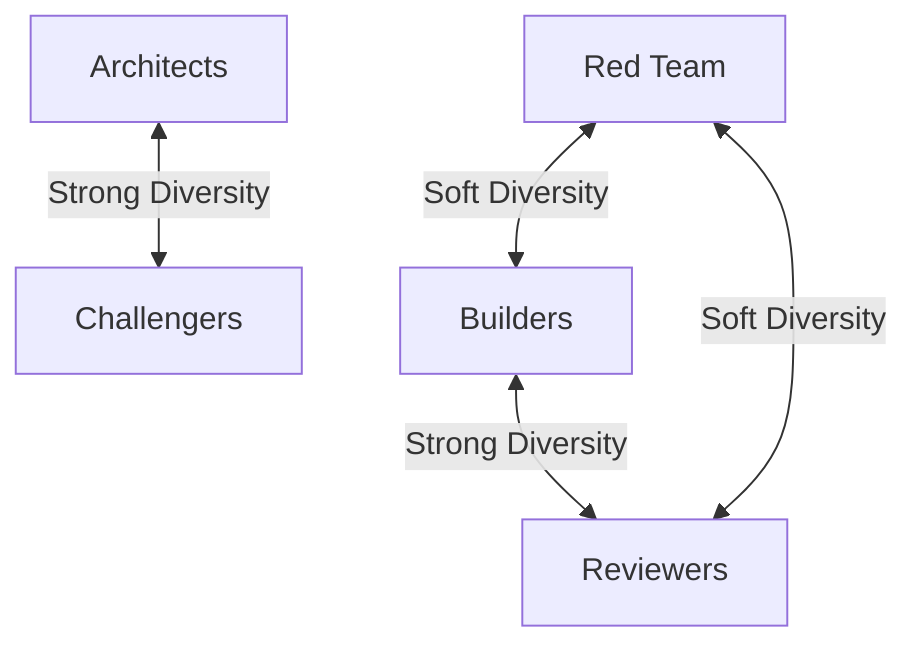

# Agent Catalog

OpenCode Autopilot uses a multi-agent architecture where specialized agents handle distinct parts of the software development lifecycle. These agents are organized into model groups to ensure adversarial diversity and optimal performance.

## Model Groups

The system organizes agents into eight groups based on their cognitive requirements. Each group should ideally use a different model family to maximize the benefits of adversarial review.

| Group | Purpose | Recommendation |
|-------|---------|----------------|
| Architects | System design, task decomposition, pipeline orchestration | Most powerful model available. Bad architecture cascades into everything downstream. |
| Challengers | Challenge architecture proposals, enhance ideas, find design flaws | Strong model, different family from Architects for genuine adversarial review. |
| Builders | Write production code | Strong coding model. This is where most tokens are spent. |
| Reviewers | Find bugs, security issues, logic errors in code | Strong model, different family from Builders to catch different classes of bugs. |
| Red Team | Final adversarial pass - hunt exploits, find UX gaps | Different family from both Builders and Reviewers for a third perspective. |
| Researchers | Domain research, feasibility analysis, information gathering | Good context window and comprehension. Any model family works. |
| Communicators | Write docs, changelogs, extract lessons | Mid-tier model. Clear writing matters more than deep reasoning. |
| Utilities | Fast lookups, prompt tuning, PR scanning | Fastest available model. Speed over intelligence - don't waste expensive tokens on grep. |

## Standard Agents

These nine agents are the primary tools visible in the OpenCode interface. They handle common development tasks and are accessible through the standard Tab cycle.

| Agent | Role | Model Group |
|-------|------|-------------|
| autopilot | Full autonomous orchestration | Architects |
| coder | Production code implementation | Builders |
| debugger | Bug diagnosis and resolution | Builders |
| planner | Task decomposition and planning | Architects |
| researcher | Domain research and analysis | Researchers |
| reviewer | Code review orchestration | Reviewers |
| documenter | Documentation generation | Communicators |
| metaprompter | Prompt tuning and optimization | Utilities |
| pr-reviewer | Pull request scanning | Utilities |

## Pipeline Agents

The autonomous pipeline uses ten specialized agents to drive each phase of development. These agents work behind the scenes to transform an idea into shipped code.

| Agent | Role | Model Group |
|-------|------|-------------|
| oc-researcher | Domain research and feasibility assessment | Researchers |
| oc-challenger | Proposes ambitious enhancements to ideas | Challengers |
| oc-architect | Generates multiple design proposals | Architects |
| oc-critic | Debates and critiques architecture proposals | Challengers |
| oc-planner | Decomposes architecture into task waves | Architects |
| oc-implementer | Implements code with inline review | Builders |
| oc-reviewer | Multi-agent review orchestration | Reviewers |
| oc-shipper | Generates walkthroughs and changelogs | Communicators |
| oc-retrospector | Extracts lessons for future runs | Communicators |
| oc-explorer | Speculative analysis and exploration | Researchers |

## Review Agents

The `oc_review` tool dispatches thirteen specialized agents across four stages. This multi-agent approach catches bugs that single-model reviews often miss.

### Universal (always run)

These six agents run on every review regardless of the stack.

*   **logic-auditor**: Checks control flow, null safety, async correctness, and boundary conditions.
*   **security-auditor**: Systematic OWASP auditing, auth/authz correctness, secrets, and injection.
*   **code-quality-auditor**: Enforces readability, modularity, naming, and file organization.
*   **test-interrogator**: Evaluates test quality, assertion coverage, and edge case gaps.
*   **code-hygiene-auditor**: Finds dead code, unused imports, debug artifacts, and silent failure patterns.
*   **contract-verifier**: Verifies API boundary correctness and request/response shape alignment.

### Stack-aware (auto-selected)

The system auto-selects these five agents based on the changed file types.

*   **architecture-verifier**: Checks end-to-end connectivity, scope and intent alignment, and requirement compliance.
*   **database-auditor**: Audits migrations, query performance, schema design, and connection management.
*   **correctness-auditor**: Verifies type correctness, invariant design, async safety, and concurrency safety.
*   **frontend-auditor**: Enforces frontend framework rules, hooks/reactivity, state management, and stale closures.
*   **language-idioms-auditor**: Applies language-specific safety and idiom checks for Go, Python, and Rust.

### Sequenced (run last)

These two agents run last after all other findings are collected.

*   **red-team**: Performs an adversarial final pass to find inter-domain gaps and exploit scenarios.
*   **product-thinker**: Evaluates UX impact, feature completeness, and user journey dead ends.

## Adversarial Diversity

Adversarial diversity is the core principle of the Autopilot system. Using different model families for competing roles prevents shared blind spots and confirmation bias.

### Diversity Rules

*   **Architects vs Challengers**: Same-model review creates confirmation bias. The model tends to agree with its own reasoning patterns.
*   **Builders vs Reviewers**: Same model shares the same blind spots. It won't catch errors it would also make during implementation.
*   **Red Team vs Builders and Reviewers**: Red Team is most effective as a third perspective. It hunts for bugs that hide between the domains of other agents.

## Agent Visibility

The plugin suppresses native OpenCode `plan` and `build` agents to avoid duplication. The primary agents appearing in the Tab cycle are:

*   autopilot
*   coder
*   debugger
*   planner
*   researcher
*   reviewer

---
[Documentation Index](README.md)
