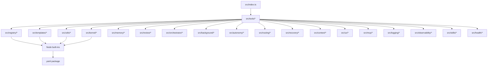
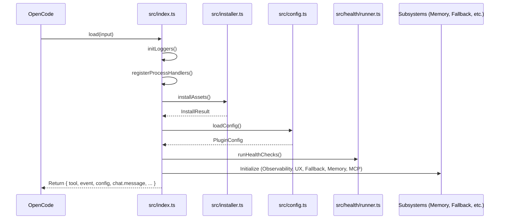

# System Architecture

This document provides a comprehensive overview of the OpenCode Autopilot system architecture. The plugin is designed as a Bun-only npm package that provides autonomous SDLC orchestration, multi-agent code review, smart memory, and adaptive skills for the OpenCode AI coding CLI.

## Two-Layer Design

The plugin follows a two-layer architecture:

1.  **JS/TS Module Layer**: A TypeScript codebase that registers tools and hooks via the `@opencode-ai/plugin` SDK. This layer handles the logic, state management, and orchestration.
2.  **Filesystem Asset Layer**: Markdown files (agents, skills, and commands) that are bundled with the plugin and copied to `~/.config/opencode/` on every load. This ensures that the plugin's capabilities are available to the OpenCode CLI even when the plugin logic is not actively executing.

## Module Directory Tree

The following tree describes the purpose of each module in the `src/` directory:

- `src/index.ts`: Plugin entry point. It registers all tools, hooks, and runs the self-healing asset installer on every load.
- `src/config.ts`: Zod-validated configuration system with a migration chain from v1 to v7.
- `src/installer.ts`: Self-healing asset copier that uses `COPYFILE_EXCL` to ensure it never overwrites user-customized files.
- `src/registry/`: Manages the agent registry, model groups, adversarial diversity rules, and model resolution.
- `src/tools/`: Tool definitions. These are thin wrappers that call `*Core` functions for testability.
- `src/templates/`: Pure functions that transform input data into markdown strings for agents and skills.
- `src/review/`: A 13-agent review engine with stack-aware gating, memory, and severity classification.
- `src/orchestrator/`: The core pipeline state machine. It handles phase transitions, fallback logic, and artifact management.
- `src/background/`: Background task management with slot-based concurrency and SQLite persistence.
- `src/autonomy/`: The autonomy loop that drives the pipeline with verification checkpoints.
- `src/routing/`: Category-based task routing that maps intents to specific models and skills.
- `src/recovery/`: Session recovery and failure resilience using retry, fallback, and checkpoint strategies.
- `src/context/`: Context window management, token budgeting, and system prompt injection.
- `src/ux/`: User experience surfaces, including notifications, progress tracking, and error hints.
- `src/mcp/`: Integration with the Model Context Protocol (MCP) for external tool and resource access.
- `src/kernel/`: Database primitives and concurrency management, including SQLite transactions and retries.
- `src/logging/`: Structured logging with multiple sinks and log rotation.
- `src/memory/`: Smart dual-scope memory that tracks project patterns and user preferences.
- `src/observability/`: Session observability and structured event logging for forensic analysis.
- `src/skills/`: Adaptive skill loading and injection based on the current task context.
- `src/health/`: Plugin self-diagnostics and health check runner.
- `src/utils/`: Shared utilities for validation, path management, and filesystem helpers.
- `src/agents/`: Type definitions for agent configurations.
- `src/config/`: Type definitions for the configuration subsystem.
- `src/hooks/`: Handlers for various OpenCode plugin hooks.
- `src/inspect/`: Utilities for inspecting session state and artifacts.
- `src/projects/`: Logic for detecting project roots and types.
- `src/scoring/`: Utilities for scoring model outputs and review findings.
- `src/types/`: Shared TypeScript type definitions used across the project.
- `bin/cli.ts`: CLI entry point for standalone commands like `install`, `doctor`, and `configure`.

## Dependency Flow

The system enforces a strict top-down dependency flow to prevent circular dependencies and ensure maintainability.

## Initialization Sequence

The following diagram shows the sequence of events when the plugin is loaded by OpenCode.

## Key Architectural Patterns

The plugin employs several key patterns to ensure reliability and performance:

- **Declarative Registry**: Adding a new agent or model group requires only a single line in the `AGENT_REGISTRY`. All other systems, including the configuration UI and model resolver, derive their state from this registry.
- **Atomic Writes**: All filesystem operations that modify configuration or state use a temporary file and rename pattern. This prevents data corruption during crashes or concurrent access.
- **Immutable State**: Data structures are treated as immutable. The system uses deep-frozen objects, spread operators, and readonly arrays to prevent accidental side effects.
- **Bidirectional Validation**: The configuration system uses Zod to validate data both when reading from the disk and before writing back. This ensures that the configuration remains consistent with the schema.
- **Self-Healing Assets**: The plugin bundles its core agents, skills, and commands. On every load, the installer verifies that these assets exist in the user's global configuration directory and copies them if they are missing.

## Dependency Flow Rules

- **Strictly Top-Down**: Modules at a higher level (e.g., `src/index.ts`) can import from lower-level modules (e.g., `src/utils/*`), but never the reverse.
- **No Cycles**: Circular dependencies are strictly forbidden. If two modules need to share logic, that logic must be extracted into a common lower-level utility.
- **Thin Tool Wrappers**: Tools in `src/tools/` should contain minimal logic. They should primarily parse arguments and delegate to core functions in other modules.

## Navigation

[Documentation Index](README.md)
