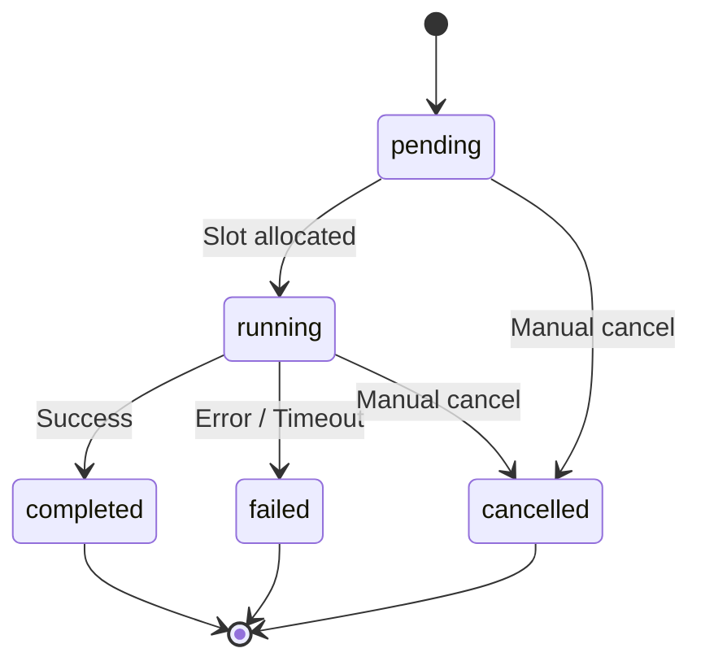
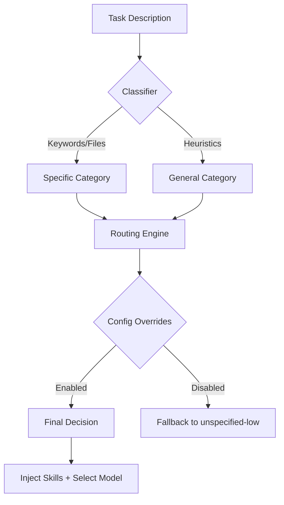
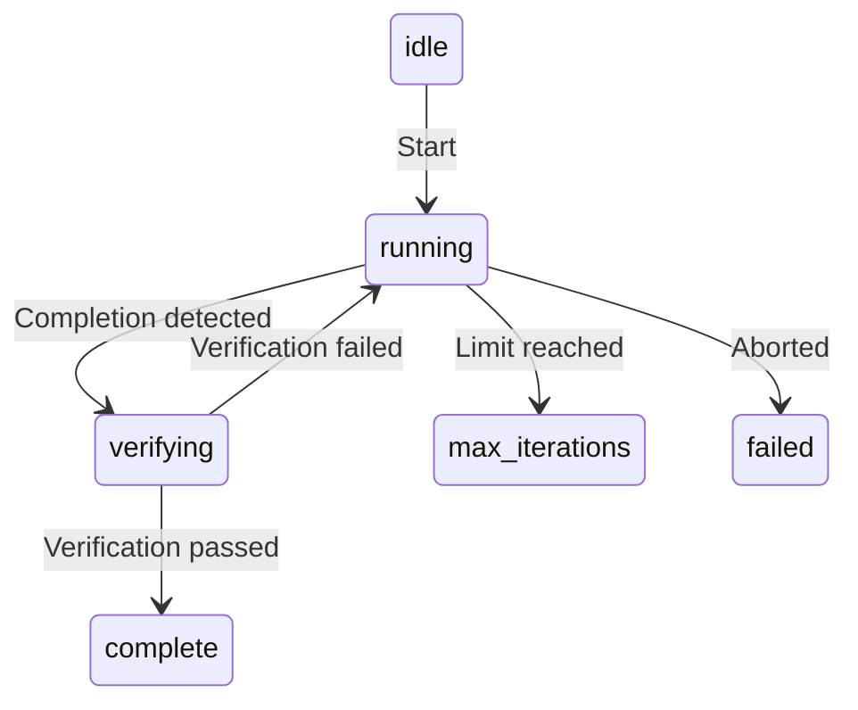

# Background Tasks, Routing, and Autonomy

OpenCode Autopilot v7.0 introduces three interconnected subsystems that enable long running operations, intelligent task delegation, and iterative development cycles. These systems work together to transform the CLI from a reactive tool into an autonomous agent.

## Overview

The orchestration layer is built on three pillars:

1.  **Background Task Management**: A persistent execution engine that handles non blocking tasks across sessions.
2.  **Category Routing**: An intent classification system that maps tasks to the most capable model groups and specialized skills.
3.  **Autonomy Loop**: A stateful controller that manages iterative "plan, build, verify" cycles until a task is confirmed complete.

## Background Task Management

The background system allows the plugin to spawn tasks that run independently of the primary chat flow. This is essential for multi agent reviews, large scale refactoring, and long running research.

### Task Lifecycle

Tasks follow a strict state machine persisted in a local SQLite database. This ensures that task status is preserved even if the session is interrupted.

### Slot-based Concurrency

To prevent resource exhaustion and model rate limiting, the background manager uses a slot based concurrency model.

*   **Configurable Capacity**: The number of concurrent slots is controlled by `background.maxSlots` (default: 5).
*   **Priority Queueing**: Tasks are assigned a priority (0 to 100). When a slot becomes available, the highest priority pending task is allocated.
*   **Isolation**: Each slot operates with its own execution context and timeout monitoring.

### Persistence and Recovery

All background tasks are stored in the `background_tasks` table within the plugin kernel database. This allows for:

*   **Cross-session Monitoring**: View the status of tasks started in previous sessions.
*   **Result Retrieval**: Access the output or error logs of completed tasks at any time.
*   **Audit Trails**: Maintain a history of all background operations for forensic analysis.

### Timeout Handling

Every background task is wrapped in a timeout guard. If a task exceeds the `background.defaultTimeout` (or a task specific override), the execution is aborted via `AbortController`, and the task is marked as `failed`.

## Category Routing

Category routing ensures that every task is handled by the right model with the right set of skills. Instead of using a single model for everything, the routing engine classifies the intent and dispatches the task accordingly.

### Category Definitions

The system defines several specialized categories, each with its own model group and skill requirements:

| Category | Description | Model Group | Default Skills |
| :--- | :--- | :--- | :--- |
| `quick` | Trivial, low risk tasks | `utilities` | None |
| `visual-engineering` | UI, UX, and styling | `builders` | `frontend-design`, `frontend-ui-ux` |
| `ultrabrain` | Logic heavy or algorithmic work | `architects` | None |
| `artistry` | Creative or novel solutions | `architects` | None |
| `writing` | Documentation and prose | `communicators` | `coding-standards` |
| `unspecified-low` | General, moderate complexity | `utilities` | None |
| `unspecified-high` | General, high complexity | `builders` | None |

### Intent Classification

The classification engine uses three layers of analysis to determine the category:

1.  **File Patterns**: Matches changed files against known extensions (e.g., `.css` triggers `visual-engineering`).
2.  **Keyword Matching**: Scans the task description for specific signals (e.g., "optimize" triggers `ultrabrain`).
3.  **Heuristics**: Analyzes description length and complexity signals (e.g., "implement authentication") to distinguish between `unspecified-low` and `unspecified-high`.

### Routing Flow

## Autonomy Loop

The autonomy loop orchestrates the iterative development process. It allows the plugin to continue working on a task until it meets the defined completion criteria and passes all verification checks.

### Loop Lifecycle

The loop manages the transition between execution and verification.

### Completion Detection

The system monitors the session transcript for signals that indicate a task is finished. It looks for:

*   **Positive Signals**: Phrases like "all tasks completed", "finished", or "done".
*   **Todo Signals**: Indications that the task list is empty.
*   **Negative Signals**: Phrases like "still working" or "in progress" which reset the completion confidence.

### Post-Iteration Verification

Before a loop can transition to `complete`, it must pass a series of verification checks:

1.  **Tests**: Runs `bun test` to ensure no regressions were introduced.
2.  **Lint**: Runs `bun run lint` to verify code style and quality.
3.  **Artifacts**: Checks for the existence of expected files or directories.

If any check fails, the failure details are injected back into the loop context, and the agent performs another iteration to fix the issues.

## Configuration

These subsystems are configured in `opencode-autopilot.json`.

### Background Options

*   `background.maxSlots`: Maximum number of concurrent background tasks (default: 5).
*   `background.defaultTimeout`: Default timeout in milliseconds for background tasks (default: 300000).

### Routing Options

*   `routing.enabled`: Whether to use category based routing (default: false).
*   `routing.defaultCategory`: The category to use when classification confidence is low (default: "unspecified-low").

### Autonomy Options

*   `autonomy.enabled`: Whether to enable iterative autonomy loops (default: false).
*   `autonomy.maxIterations`: Maximum number of iterations before the loop stops (default: 10).
*   `autonomy.verification`: Strictness of post iteration checks (`strict`, `normal`, `lenient`).

---

[Documentation Index](README.md)
