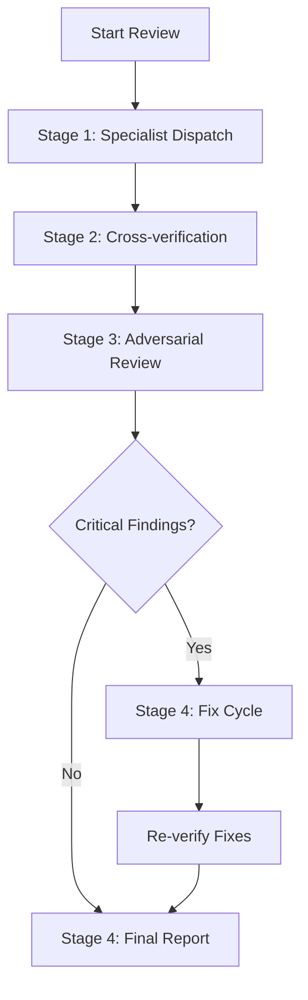

# Code Review Pipeline

The OpenCode Autopilot Plugin uses an adversarial multi-agent system to review code changes. This pipeline catches bugs that single-model reviews often miss by using different model families for builders and reviewers.

## Review Philosophy

The core of the review engine is adversarial model diversity. When the builder agent uses one model family, the reviewer agents use a different one. This prevents shared blind spots and confirmation bias. The pipeline further scales this by using 13 specialized agents across four distinct stages.

## Pipeline Flow

## Stage 1: Specialist Dispatch

Pipeline execution begins by analyzing changed files to detect the project stack. It then dispatches a squad of specialized agents in parallel. Each agent focuses on a specific domain like security, logic, or database performance.

Universal agents always run. Stack-aware agents are selected only when relevant files are detected. This approach provides deep coverage without wasting tokens on irrelevant checks.

## Stage 2: Cross-verification

Findings from the first stage aren't immediately reported. Instead, agents review each other's findings. This stage filters out noise, identifies false positives, and catches missed issues by providing agents with context from other agents' observations. It turns a collection of individual reports into a cohesive analysis.

## Stage 3: Adversarial Review

Once the initial findings are verified, the pipeline runs a final adversarial pass. Red-team agents hunt for exploits and logic gaps that might hide between agent domains. Simultaneously, the product-thinker agent checks for UX gaps and feature completeness. These agents receive all prior findings to ensure they can spot complex, multi-domain issues.

## Stage 4: Report or Fix Cycle

Outcome of the review is determined in the final stage. When the pipeline detects CRITICAL findings with actionable fixes, it triggers an automatic fix cycle. Affected agents are re-dispatched with the updated code to verify the fixes. If no critical issues remain, or if the fixes are verified, the pipeline generates a final report.

## Review Agent Catalog

The pipeline uses 13 specialized agents grouped by their role and selection logic.

### Universal Agents
These agents run on every review regardless of the stack:
*   **logic-auditor**: Checks control flow, null safety, and async correctness.
*   **security-auditor**: Performs systematic OWASP auditing and hunts for injection or auth gaps.
*   **code-quality-auditor**: Measures function length, nesting depth, and naming conventions.
*   **test-interrogator**: Evaluates test quality and assertion coverage.
*   **code-hygiene-auditor**: Finds unused code, debug artifacts, and silent failure patterns.
*   **contract-verifier**: Ensures API boundary correctness and request/response alignment.

### Stack-aware Agents
These agents are auto-selected based on detected file types:
*   **architecture-verifier**: Traces feature paths and checks for layer alignment.
*   **database-auditor**: Reviews migrations, query performance, and schema design.
*   **correctness-auditor**: Verifies type correctness and concurrency safety.
*   **frontend-auditor**: Checks framework rules for React, Vue, Svelte, or Angular.
*   **language-idioms-auditor**: Applies stack-specific patterns for Go, Python, or Rust.

### Sequenced Agents
These agents run last with full context of all prior findings:
*   **red-team**: Conducts adversarial attacks and inter-domain gap analysis.
*   **product-thinker**: Evaluates UX impact and feature completeness.

## Stack Detection Logic

Deterministic selection processes help the engine pick the right agents for the job. It first identifies stack tags from the project files. Universal agents pass the gate automatically. Gated agents must match at least one detected stack tag to be included. A diversity limit may be applied to keep the review squad focused and efficient.

## Severity Levels

Findings are categorized by severity to help prioritize fixes.

*   **CRITICAL**: Runtime errors, data loss, security vulnerabilities, or broken API contracts. These findings block the PR and must be fixed.
*   **HIGH**: Edge case gaps, weak tests, or partial implementations. Fixes are strongly recommended.
*   **MEDIUM**: Minor performance concerns or inconsistent patterns. Fix when convenient.
*   **LOW**: Naming inconsistencies or style mismatches. Fix if convenient.
*   **INFO**: General observations or suggestions for future improvement.

## Review Memory

Project memory is maintained by the system to improve over time. It stores recent findings and false positives in the project kernel database (SQLite), with a JSON file maintained as a compatibility mirror during the migration window. If you mark a finding as a false positive, the engine suppresses it in future reviews. To keep the memory lean, entries older than 30 days are automatically pruned.

## Fix Cycle Details

When a CRITICAL finding includes a clear, actionable suggestion, the pipeline attempts to fix it automatically. Vague suggestions using words like "perhaps" or "might" are filtered out by the engine. If a fix is applied, the pipeline re-runs the relevant agents to verify the resolution and ensure no new bugs were introduced.

---
[Documentation Index](README.md)
