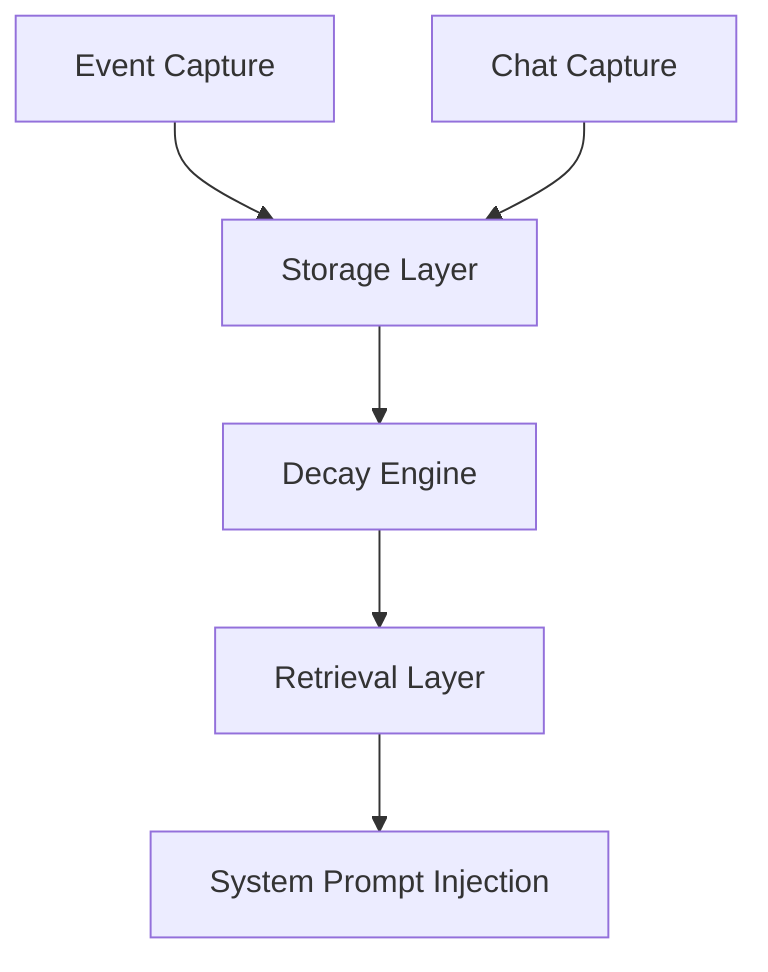

# Memory System

The OpenCode Autopilot memory system provides persistent, dual-scope context for autonomous development. It tracks project-specific patterns and user-wide preferences to improve model performance over time.

## Dual-Scope Design

The system maintains two distinct scopes of memory:

1. **Project Scope**: Tracks patterns, architectural decisions, common errors, and coding conventions specific to a single repository. This ensures the agent adapts to the unique requirements of each project.
2. **User Scope**: Tracks global user preferences, coding style, and tool usage patterns across all projects. This provides a consistent experience for the developer regardless of the repository.

## Memory Pipeline

The following diagram shows the flow of information from capture to injection.

## Database Schema

Memory is stored in a SQLite database using `bun:sqlite`. It uses FTS5 for full-text search on observations.

### Core Tables

- **observations**: Stores decisions, patterns, errors, and tool usage.
- **preference_records**: Stores confirmed preferences with global or project scope.
- **preference_evidence**: Tracks statements and sessions that support a preference.
- **projects**: Tracks project metadata and last-seen timestamps.
- **project_lessons**: Stores extracted lessons from completed pipeline runs.

### Full-Text Search

The `observations_fts` virtual table enables fast retrieval of relevant historical context based on the current task description. Triggers automatically synchronize the FTS index with the `observations` table.

## Capture System

The capture system is event-driven and non-intrusive.

### Event-Driven Capture

The system listens for internal events to record observations:
- **session.created**: Initializes project identity and session tracking.
- **app.decision**: Records architectural or implementation decisions with rationale.
- **session.error**: Captures failure modes and error messages for future avoidance.
- **app.phase_transition**: Tracks patterns in the autonomous pipeline flow.

### Explicit Preference Capture

The system analyzes chat messages for explicit preference statements. When a user specifies a style or tool preference, it is recorded as a candidate and confirmed through evidence tracking.

## Storage and Repository Layer

The repository layer provides a unified API for managing memory assets. It handles CRUD operations for observations, preferences, projects, and lessons. All writes are atomic and use SQLite transactions to ensure data integrity.

## Decay Algorithm

To prevent context bloat and prioritize recent information, the system applies an exponential decay algorithm to all observations.

### Relevance Formula

The relevance score is calculated as:
`Score = TimeDecay * FrequencyWeight * TypeWeight`

- **TimeDecay**: `exp(-AgeDays / HalfLifeDays)`. The default half-life is 90 days.
- **FrequencyWeight**: `max(log2(AccessCount + 1), 1)`. Frequently accessed memories stay relevant longer.
- **TypeWeight**: Specific multipliers for different observation types (e.g., decisions are weighted higher than tool usage).

### Pruning

The system automatically prunes stale observations when they fall below a relevance threshold or when a project exceeds the maximum observation cap (default 10,000).

## 3-Layer Progressive Retrieval

Retrieval uses a 3-layer strategy to build the most relevant context within a token budget.

1. **Layer 1: Confirmed Preferences**: Global and project-specific preferences are injected first as they represent the highest-confidence constraints.
2. **Layer 2: Recent Lessons**: Lessons extracted from the most recent successful runs provide high-value architectural guidance.
3. **Layer 3: Failure Avoidance**: Recent error observations are ranked by relevance to help the agent avoid repeating past mistakes.

## System Prompt Injection

Memory is injected into the model via the `experimental.chat.system.transform` hook.

- **Token Budgeting**: The system enforces a default 2,000-token cap for memory injection. This prevents memory from displacing the primary task instructions.
- **Best-Effort Injection**: The injection process is designed to be non-blocking. If memory retrieval fails, the system logs a warning and continues with an empty context rather than crashing the session.
- **Caching**: Context is retrieved once per session and cached to minimize database overhead.

## Configuration Options

Memory behavior can be tuned in the plugin configuration:

- `memory.tokenBudget`: Maximum tokens allocated for memory injection (default: 2000).
- `memory.halfLifeDays`: Days until a memory loses half its relevance (default: 90).
- `memory.maxObservations`: Maximum observations stored per project (default: 10000).

---
[Documentation Index](README.md)
