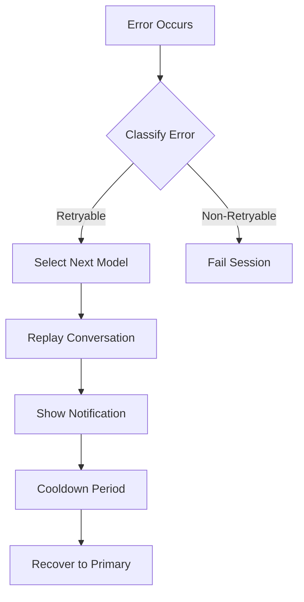
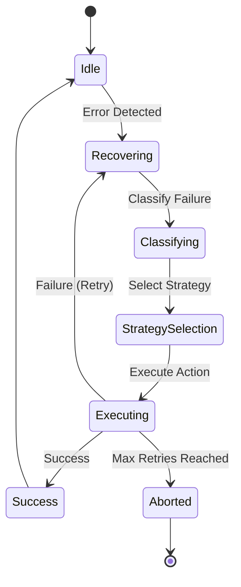

# Model Fallback and Session Recovery

The OpenCode Autopilot Plugin provides a dual-layer resilience system to handle model failures and session interruptions. The fallback system manages model-level failures during active conversations, while the recovery system handles higher-level session failures and state persistence.

## Fallback System

The fallback system automatically switches to an alternate model when the primary model fails due to rate limits, service outages, or quota exhaustion.

### Fallback Flow

1. **Error Detection**: The system intercepts errors during model calls.
2. **Classification**: Errors are classified to determine if they are retryable on a different model.
3. **Selection**: The next model is selected from the agent's fallback chain, skipping models currently in cooldown.
4. **Replay**: The conversation history is replayed on the new model to maintain context.
5. **Notification**: A toast notification informs the user of the fallback event.
6. **Recovery**: After a configurable cooldown period, the system attempts to return to the primary model for subsequent requests.

### Error Classification

The fallback system classifies errors into the following types:

| Error Type | Description | Retryable |
|------------|-------------|-----------|
| `rate_limit` | API rate limits (429) | Yes |
| `quota_exceeded` | Insufficient credits or quota | Yes |
| `service_unavailable` | Provider outages (503, 529) | Yes |
| `missing_api_key` | API key not configured | Yes |
| `model_not_found` | Requested model is unavailable | Yes |
| `content_filter` | Content blocked by safety filters | No |
| `context_length` | Context window exceeded | No |
| `unknown` | Unclassified errors | Yes (if pattern matches) |

### Fallback Chain Resolution

Fallback chains are resolved using a two-tier hierarchy:

1. **Per-Agent Overrides**: Defined in `.opencode.json` under the agent's `fallback_models` field.
2. **Global Fallbacks**: Defined in the plugin configuration under `groups` or global `fallback_models`.

The system normalizes these into a prioritized list of models for the fallback manager to iterate through.

## Recovery System

The recovery system provides resilience against session-level failures, such as network interruptions, session corruption, or agent loops.

### Recovery Strategies

The orchestrator selects a strategy based on the failure category:

*   **Retry**: Uses exponential backoff for transient failures like network issues or timeouts.
*   **Fallback**: Switches to an alternate model from the fallback chain for model-specific failures.
*   **Checkpoint**: Saves and restores session state to SQLite, allowing recovery from partial failures or session corruption.
*   **Compact and Retry**: Reduces context size when the context window is exceeded.
*   **Skip and Continue**: Advances the pipeline when an agent appears to be stuck in a loop.

### Strategy Mapping

| Category | Strategy |
|----------|----------|
| `rate_limit`, `timeout`, `network`, `service_unavailable` | Retry with backoff |
| `quota_exceeded`, `empty_content`, `thinking_block_error` | Fallback model |
| `tool_result_overflow`, `context_window_exceeded` | Compact and retry |
| `session_corruption` | Restart session |
| `agent_loop_stuck` | Skip and continue |
| `validation` | User prompt |
| `auth_failure` | Abort |

### Recovery State Diagram

### Checkpoint Persistence

Recovery state is persisted to a local SQLite database in the `recovery_state` table. This ensures that recovery can continue even if the OpenCode process is restarted.

The persisted state includes:
*   Session ID
*   History of recovery attempts
*   Current recovery strategy
*   Last error message
*   Metadata for strategy execution (e.g., model to switch to)

## Configuration

Configuration options for fallback and recovery systems are managed in `opencode-autopilot.json`.

### Fallback Options

| Option | Default | Description |
|--------|---------|-------------|
| `fallback.enabled` | `true` | Enable or disable the fallback system |
| `fallback.maxFallbackAttempts` | `10` | Maximum number of fallback attempts per session |
| `fallback.cooldownSeconds` | `60` | Seconds to wait before retrying a failed model |
| `fallback.timeoutSeconds` | `30` | Time to wait for first token before triggering fallback |
| `fallback.notifyOnFallback` | `true` | Show toast notifications on fallback events |

### Recovery Options

| Option | Default | Description |
|--------|---------|-------------|
| `recovery.enabled` | `true` | Enable or disable session recovery |
| `recovery.maxRetries` | `3` | Maximum number of recovery attempts per session (0-10) |

---
[Documentation Index](README.md)
