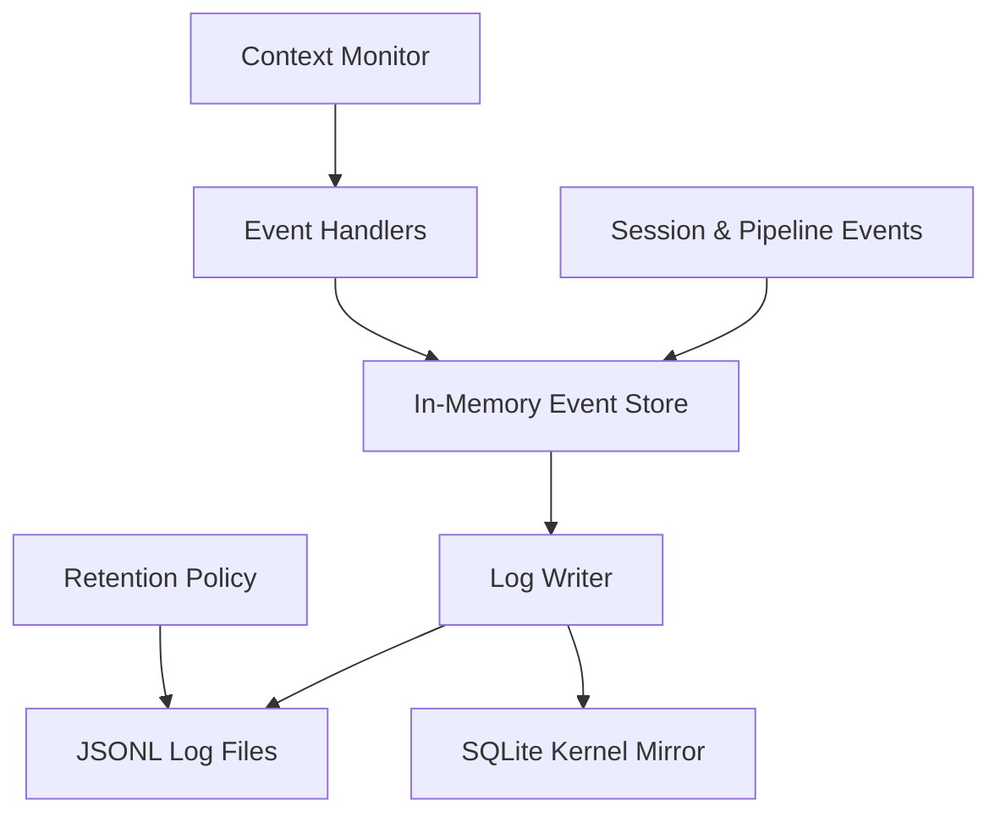

# Observability

The observability system provides deep visibility into the autonomous SDLC pipeline, tracking every event, model decision, and tool execution. It combines in-memory session tracking with structured JSONL logging and a comprehensive health diagnostic suite.

## System Overview

The system follows a reactive architecture where events from the OpenCode session and the autopilot pipeline are captured, processed, and persisted.

## Event Store

The `SessionEventStore` is an in-memory collection point for all observability data during an active session. It accumulates:

*   **Observability Events**: Fallbacks, errors, model switches, decisions, and phase transitions.
*   **Token Aggregates**: Cumulative input, output, and reasoning tokens.
*   **Tool Metrics**: Invocations, duration, and success/failure counts per tool.
*   **Pipeline State**: The current active phase of the SDLC pipeline.

Data is held in memory to minimize I/O during high-frequency operations and is flushed to disk when the session becomes idle or ends.

## Event Handlers

Hook handlers integrate the observability system with the OpenCode lifecycle:

*   **session.created**: Initializes the session store and context monitor.
*   **session.error**: Classifies model or provider errors and records them as structured events.
*   **message.updated**: Captures token usage from assistant messages and updates the context monitor.
*   **session.idle / session.deleted**: Triggers a flush of unpersisted events to the log writer.
*   **tool.execute.before / after**: Measures tool execution duration and records success status.

## Context Monitoring

The `ContextMonitor` tracks token usage against model limits to prevent context overflow.

*   **Utilization Tracking**: Computes the ratio of used tokens to the model's context window.
*   **Warning System**: Triggers a warning when utilization reaches 80%.
*   **One-Time Notification**: Fires a single toast notification per session to avoid alert fatigue.
*   **UX Integration**: Integrates with the warning system to provide remediation hints.

## Log Writer

The log writer persists session data as structured JSONL (JSON Lines) for machine parsing and forensic analysis.

*   **Format**: Each line is a valid JSON object containing a timestamp, domain, event type, and payload.
*   **Location**: Logs are stored in the project artifact directory (`.opencode-autopilot/`).
*   **Atomic Writes**: Uses atomic append operations to ensure log integrity even during crashes.
*   **Redaction**: Automatically redacts absolute file paths from log messages to protect user privacy.

## Log Retention

To prevent unbounded disk usage, the system implements a time-based retention policy.

*   **Default Policy**: Logs are retained for 30 days.
*   **Pruning**: A non-blocking pruning task runs on plugin load, removing files older than the retention threshold.
*   **Graceful Handling**: Handles missing directories and race conditions during file deletion.

## Health Diagnostics

The `oc_doctor` tool runs a suite of 11 health checks to ensure the plugin is correctly configured and operational.

1.  **config-validity**: Verifies `opencode-autopilot.json` exists and passes schema validation.
2.  **agent-injection**: Ensures all 13+ specialized agents are correctly registered in OpenCode.
3.  **native-agent-suppression**: Confirms native plan/build agents are disabled to prevent conflicts.
4.  **asset-directories**: Checks that source and target asset directories are accessible.
5.  **skill-loading**: Validates that adaptive skills are correctly loaded for the detected project stack.
6.  **memory-db**: Verifies the SQLite memory database is readable and contains observations.
7.  **command-accessibility**: Checks that all slash commands have valid YAML frontmatter and descriptions.
8.  **config-v7-fields**: Ensures modern configuration fields (background, routing, recovery, MCP) are present.
9.  **routing-health**: Validates task routing categories and model group assignments.
10. **mcp-health**: Checks the status of any active MCP (Model Context Protocol) servers.
11. **lsp-servers**: Validates LSP server configuration and connectivity.

## Forensic Logging

Forensic logging provides a high-fidelity audit trail in `orchestration.jsonl`. This file contains the complete reasoning chain, including:

*   **Model Decisions**: The rationale behind every architectural choice or plan adjustment.
*   **Phase Transitions**: Precise timestamps for every stage of the autonomous pipeline.
*   **Tool Telemetry**: Detailed input/output and performance data for every tool invocation.
*   **Failure Analysis**: Root cause classification for transient and terminal failures.

Events are mirrored to the SQLite kernel, enabling fast querying and session recovery via the `oc_forensics` tool.

---
[Documentation Index](README.md)
