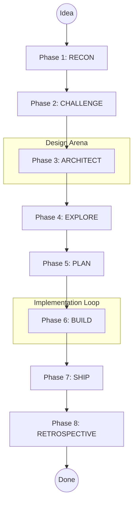
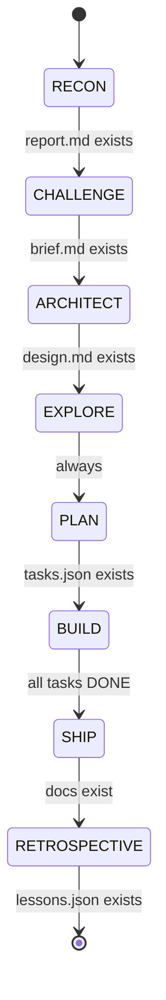

# Autonomous Development Pipeline

The OpenCode Autopilot Plugin operates through an 8-phase autonomous development pipeline. This system transforms a high-level idea into production-ready code by coordinating specialized agents, multi-proposal design arenas, and wave-scheduled implementation cycles.

## Pipeline Overview

The pipeline ensures that every feature is researched, challenged, and architected before a single line of code is written. This structured approach prevents design drift and catches potential issues early in the development lifecycle.

## Phase Details

### Phase 1: RECON
The pipeline starts with the **oc-researcher** agent. This phase focuses on domain research, feasibility assessment, and a technology landscape scan. The agent evaluates the original idea against existing solutions and identifies potential technical hurdles. The output is a comprehensive research report that includes a confidence score (HIGH, MEDIUM, or LOW) for the project.

### Phase 2: CHALLENGE
The **oc-challenger** agent takes the research findings and proposes ambitious enhancements. Instead of blindly following the initial prompt, this agent acts as a product partner, suggesting improvements that increase user value or technical reliability. These enhancements are documented in a challenge brief for the architect to consider.

### Phase 3: ARCHITECT
This phase uses a multi-proposal design arena involving **oc-architect** and **oc-critic** agents. The number of competing proposals scales based on the confidence level from the RECON phase. A critic agent evaluates the proposals, highlighting trade-offs and recommending the most viable path forward.

### Phase 4: EXPLORE
This phase is reserved for speculative analysis and future use cases. It currently serves as a placeholder for advanced simulation or prototyping capabilities that may be added in future versions of the plugin.

### Phase 5: PLAN
The **oc-planner** agent decomposes the selected architecture into a detailed task plan. Tasks are organized into waves for parallel execution. Each task is designed to produce a maximum 300-line diff, ensuring that changes remain manageable and easy to review.

### Phase 6: BUILD
The **oc-implementer** agent executes the task plan. This phase includes an inline review process where code is verified against project standards. The build process follows a strict strike system to maintain quality and prevent infinite retry loops. Waves execute in sequence, and the pipeline only advances to the next wave after all tasks in the current wave pass review.

### Phase 7: SHIP
The **oc-shipper** agent finalizes the development cycle by generating documentation. This includes a technical walkthrough of the implementation, a record of key architectural decisions with their rationale, and a user-facing changelog.

### Phase 8: RETROSPECTIVE
The **oc-shipper** agent also handles the retrospective phase, analyzing the entire run to extract lessons. These insights are stored in a persistent lesson memory and injected into future pipeline runs. This allows the system to learn from past successes and failures, improving its performance over time.

## Confidence-Driven Architecture

The ARCHITECT phase adapts its depth based on the confidence signals gathered during research. This multi-proposal arena ensures that complex or uncertain requirements receive more rigorous design scrutiny.

*   **High Confidence**: A single architecture proposal is generated.
*   **Medium Confidence**: Two competing proposals are created, typically contrasting simplicity against extensibility.
*   **Low Confidence**: Three competing proposals are generated, followed by a detailed evaluation from the critic agent.

## Strike-Limited Builds

The BUILD phase maintains high code quality through a strike system. Every time a task is implemented, it undergoes a review.

*   **Critical Findings**: Each CRITICAL review finding counts as one strike.
*   **Strike Limit**: If the strike count reaches 3, the pipeline stops. This prevents the system from wasting tokens on failing implementation attempts and signals that human intervention or a design rethink is required.
*   **Non-Critical Findings**: Findings with lower severity generate fix instructions for the implementer but do not count as strikes.

## Phase Transitions

The pipeline moves through phases based on the successful creation of required artifacts. If a run is interrupted, the orchestrator can resume from the last successful phase by verifying the existence of these artifacts.

## Navigation

[Documentation Index](README.md)
