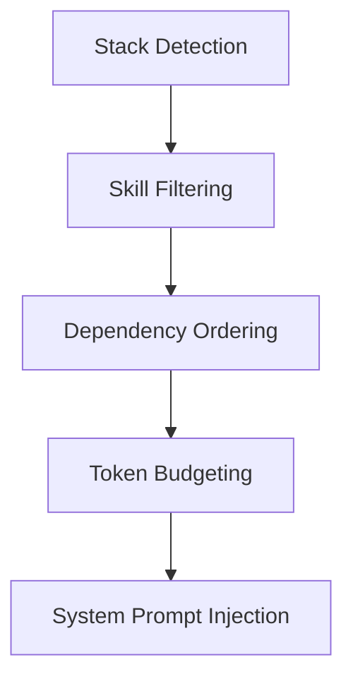

# Skills and Commands

OpenCode Autopilot provides a library of adaptive skills and slash commands that automate the software development lifecycle. These assets are installed to `~/.config/opencode/` when the plugin loads.

## Skill System Overview

The skill system uses an adaptive injection pipeline to provide agents with relevant domain knowledge without exhausting the context window.

### Adaptive Loading

The plugin detects the project stack by checking for manifest files in the root directory. For example, finding `tsconfig.json` triggers the loading of TypeScript-related skills. Methodology skills that do not specify a stack are always available.

### Token Budgeting

Injection is governed by a default budget of 8000 tokens. This limit prevents skill content from displacing critical session history or file data. If the combined size of relevant skills exceeds this budget, the system prioritizes dependencies and truncates content at section boundaries.

### Dependency Resolution

Skills can require other skills as prerequisites. The system performs a topological sort to ensure that foundational skills like `coding-standards` appear before specialized ones like `code-review` in the system prompt.

### Injection Pipeline

## Skills Reference

The plugin includes 22 built-in skills covering methodologies and language-specific patterns.

| Name | Description | Stack | Dependencies |
|------|-------------|-------|--------------|
| api-design | REST and GraphQL API design conventions. | Universal | None |
| brainstorming | Socratic design refinement methodology. | Universal | None |
| code-review | Structured methodology for code reviews. | Universal | coding-standards |
| coding-standards | Universal best practices for code quality. | Universal | None |
| csharp-patterns | Idiomatic C# and .NET patterns. | csharp | coding-standards |
| database-patterns | Schema design and query optimization. | Universal | None |
| docker-deployment | Dockerfile and CI/CD best practices. | Universal | None |
| e2e-testing | End-to-end testing patterns for user flows. | Universal | None |
| frontend-design | UX/UI design and component architecture. | react, vue, svelte, angular | None |
| git-worktrees | Isolated parallel development with worktrees. | Universal | None |
| go-patterns | Idiomatic Go and concurrency patterns. | go | None |
| java-patterns | Modern Java and Spring Boot conventions. | java | coding-standards |
| plan-executing | Systematic task execution and verification. | Universal | plan-writing |
| plan-writing | Decomposing features into bite-sized tasks. | Universal | None |
| python-patterns | Pythonic patterns and type hints. | python | None |
| rust-patterns | Safe and efficient Rust patterns. | rust | None |
| security-patterns | OWASP Top 10 and secure coding practices. | Universal | None |
| strategic-compaction | Context window management via summarization. | Universal | None |
| systematic-debugging | 4-phase root cause analysis methodology. | Universal | None |
| tdd-workflow | Strict RED-GREEN-REFACTOR methodology. | Universal | None |
| typescript-patterns | TypeScript and Bun runtime patterns. | typescript, bun | coding-standards |
| verification | Pre-completion verification checklists. | Universal | None |

## Commands Reference

Slash commands provide high-level entry points for common development tasks.

| Command | Description | Functionality |
|---------|-------------|---------------|
| `/oc-brainstorm` | Start a design session. | Uses Socratic questioning to explore 3 distinct approaches. |
| `/oc-doctor` | Check plugin health. | Diagnoses config, assets, memory, and installation paths. |
| `/oc-new-agent` | Create a custom agent. | Generates an agent markdown file with YAML frontmatter. |
| `/oc-new-command` | Create a slash command. | Scaffolds a new command file in the assets directory. |
| `/oc-new-skill` | Create a custom skill. | Creates a skill directory and a starter SKILL.md file. |
| `/oc-quick` | Run a quick task. | Bypasses the full pipeline for trivial implementation work. |
| `/oc-refactor` | Refactor existing code. | Applies SOLID principles and reduces code complexity. |
| `/oc-review-agents` | Audit project agents. | Scores `agents.md` for role clarity and prompt quality. |
| `/oc-review-pr` | Review a GitHub PR. | Analyzes diffs for correctness, security, and quality. |
| `/oc-security-audit` | Audit code security. | Checks for OWASP vulnerabilities and hardcoded secrets. |
| `/oc-stocktake` | Audit plugin assets. | Lists all installed agents, skills, and commands. |
| `/oc-tdd` | Implement via TDD. | Follows strict RED-GREEN-REFACTOR for new features. |
| `/oc-update-docs` | Update documentation. | Identifies and updates docs affected by recent changes. |
| `/oc-write-plan` | Generate a task plan. | Decomposes features into a wave-based execution plan. |

## In-Session Creation

You can extend the plugin's capabilities without leaving your coding session. The creation commands use the `metaprompter` agent to gather requirements conversationally before writing files to your global configuration directory.

- **`/oc-new-agent`**: Define a new specialist agent with specific tool permissions and model assignments.
- **`/oc-new-skill`**: Capture domain-specific knowledge or team-specific rules into a reusable skill.
- **`/oc-new-command`**: Create a shortcut for complex multi-step workflows or specific agent prompts.

Newly created assets are available immediately after restarting the OpenCode session.

---
[Documentation Index](README.md)
